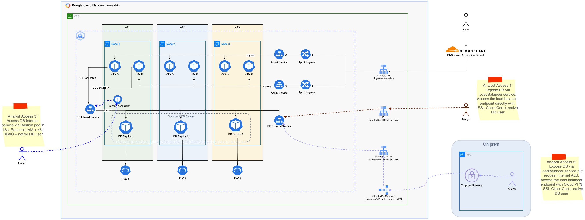
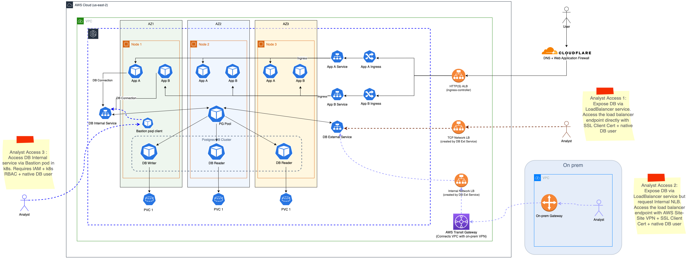
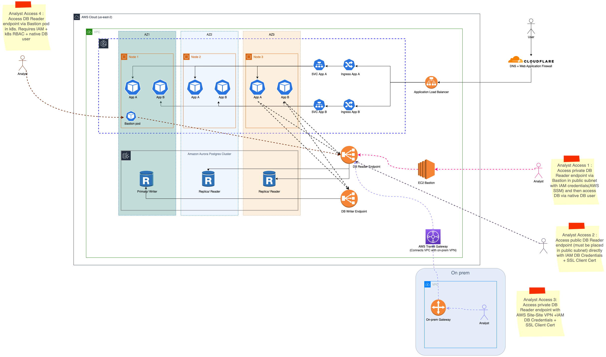

## High Level Architecture

### Scenario 1: GCP GKE with Highly available CockroachDB

In this scenaio we can see from a high-level how we could use a GKE cluster to provision the two services along with a highly available CockraochDB Cluster



#### About CockroachDB
What is [CockroachDB](https://www.cockroachlabs.com/) (CRDB)?
From [cockroachlabs](https://www.cockroachlabs.com/docs/stable/frequently-asked-questions.html#what-is-cockroachdb):

> CockroachDB (CRDB) is a distributed SQL database built on a transactional and strongly-consistent key-value store. It scales horizontally; survives disk, machine, rack, and even datacenter failures with minimal latency disruption and no manual intervention; supports strongly-consistent ACID transactions; and provides a familiar SQL API for structuring, manipulating, and querying data.

Why I like CockroachDB?

- Supports most PostgreSQL’s SQL syntax and you can connect to DB with PostgreSQL client libraries
- Strongly-consistency database. In terms of the CAP theorem, CRDB leans toward CP i.e it favors being consistent instead of available when partitions occur.
- Every transaction in CockroachDB guarantees ACID semantics spanning arbitrary tables and rows, even when data is distributed.
- CockroachDB scales horizontally without any operational overhead. Each node can service both reads and writes and hence scale both storage and transactional capacity. This scales more naturally than for example PostgreSQL where we obtain HA via deployment of an active/passive topology and sharding.

#### Architecture deep dive

##### Services
- Regional GKE cluster with node autoscaling
- Tri-Zonal Node Pool with minimum 3 nodes (1 in each AZ)
- Service A and B deployed with 3 replicas, 1 in each AZ to ensure HA. Pod Affinities used to ensure pod placement across AZs
    ```
    podAntiAffinity:
      preferredDuringSchedulingIgnoredDuringExecution:
      - podAffinityTerm:
          labelSelector:
            matchExpressions:
            - key: app.kubernetes.io/name
              operator: In
              values:
              - service-a
          topologyKey: topology.kubernetes.io/zone
        weight: 100
    ```
- Service A and B some with its own Service for intra-cluster communication
- Service A and B come with an Ingress for external access via the Ingress Controller's Load balancer

##### Database
- Deploy CockroachDB with 3 replicas following the same affinity rules to ensure HA.
- CRDB Stateful Set is deployed with a PVC per pod. These are Balanced persistent disks (pd-balanced) and are backed by solid-state drives (SSD). See [here](https://cloud.google.com/compute/docs/disks#disk-types) for more details.
- CRDB is deployed with an internal service (type=ClusterIp) for intra-cluster communication. All application would use this Service to read/write form the DB
- CRDB is deployed with an external service (type=LoadBalancer) for outside access from the internet.
- In this simple case, this endpoint is only protected via IP whitelisting and all communication is encrypted via SSL/TLS.
- In more advanced cases we could look at connecting the on-prem/ office VPN with the GKE VPC by using Cloud VPN or Cloud Interconnect, this way we can use an Internal Load Balancer that the analyst can connect through via the VPN.
- In a non-prod/ testing env we could even create a bastion psql client pod inside the cluster and exec onto it to reach the DB Internal Service.
- Analyst would require a CRDB credentials with the minimum required read permissions.

### Scenario 2: AWS EKS with Highly available Postgres

In this scenaio we can see from a high-level how we could use a EKS cluster to provision the two services along with a highly available Postgres Cluster. We explore an EKS architecture here as it the currently used cloud provider.

Note: At this point in time cockrachDB [does not support](https://github.com/cockroachdb/cockroach/issues/38847) secure helm installations on AWS EKS, hence the choice to explore postgres. But the CRDB Operator could be used instead. In any case here we explore Postgres as an option.



#### Architecture deep dive

- Essentially the architecture is similar to scenario 1 except that we deploy a postgres cluster with [PG Pool](https://www.pgpool.net/).
- To make Postgres HA, we deploy a writer and 2 reader replicas across the 3 AZs
- PG Pool load balances the client connections between replicas
- Each replica has a PVC
- High Availability is achieved via fail over and promotion of reader to writer

### Scenario 3: AWS EKS with Aurora Postgres

In this scenaio we can see from a high-level how we could use a EKS cluster to provision the two services along with Aurora Postgres, a managed RDS service by AWS.



#### About Aurora Postgres
Amazon Aurora is a relational database service that combines the speed and availability of high-end commercial databases with the simplicity and cost-effectiveness of open-source databases

Why Aurora Postgres?
- Claims 3x throughput over stock postgres
- Has a serverless offering i.e compute auto-scaling where the database automatically starts up, shuts down, and scales capacity up or down based on application needs
- Has storage autoscaling
- Multi-AZ Deployments with Aurora Replicas
- Fault-Tolerant and Self-Healing Storage
- 99.9999% uptime
- All the goodies that comes with AWS Managed Services, IAM, Security, Networking, Secrets etc.

#### Architecture deep dive

- Essentially the architecture is similar to scenario 1 except that we deploy an Aurora Postgres Cluster in the same VPC as the EKS cluster.
- Deploy Aurora Postgres Serverless with 2 read and 1 write replica across 3 AZs
- Analyst can access DB endpoint directly over the internet (if we create DB instance in public subnet and enable public endpoints) with the users IAM DB Credentials.
- In simpler/ testing cases the analyst can access the DB via an EC2 or kubernetes pod bastion
- In more advanced cases we could look at connecting the on-prem/ office VPN with the EKS VPC by using AWS Site to Site VPN, this way the analyst can access the Internal DB Reader endpoint via the on-prem VPN and thier IAM DB Credentials.

### To continue the presentation, head to the next section: [Deployments](deployments.md)