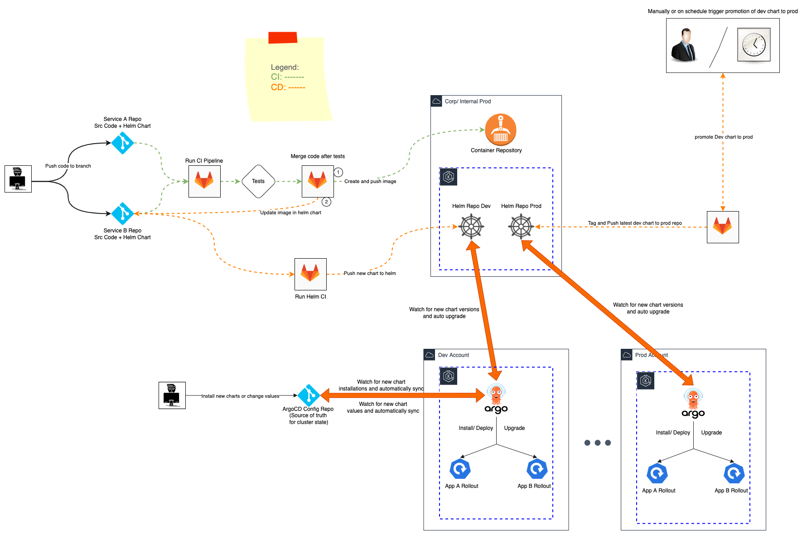
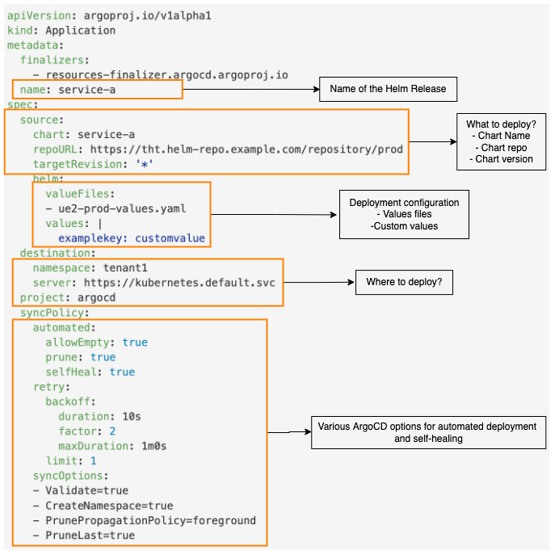

## Deployment Pipelines

In order to reliable and automatically keeping deploying new versions of our services we would build the following pipelines

### CI Pipeline Summarized
The elaboration of CI pipeline is not the goal of this exercise, hence we shortly summarize a simple generic CI pipeline here:

- The CI pipeline begins with the dev creating a new branch and pushing some code changes onto it.
- These changes are then tested in various ways (Unit tests, integration tests, e2e test etc)
- Once these tests are successful, the CI pipeline ensd with merging the branch into master and the creation of a deployable articfact such as a docker image. This [Dockerfile](repo_microservices/service-a/Dockerfile) describes how such an image can be created.
- This process can be seen in Green in the above diagram

### CD Pipeline or how do I deploy my services?

Since our goal is safe, reliable, auditable and reservable deployments and upgrades we use the following technologies to build the CD pipeline

#### Helm
   - Helm is a Kubernetes deployment tool for automating creation, packaging, configuration, and deployment of applications and services to Kubernetes clusters.
   - Helm packages are called charts
   - Charts are stored in a helm chart repository

#### ArgoCD

[Argo CD](https://argo-cd.readthedocs.io/en/stable/) is a Kubernetes controller, responsible for continuously monitoring all running applications and comparing their live state to the desired state specified in the Git repository. It identifies deployed applications with a live state that deviates from the desired state as OutOfSync. Argo CD reports the deviations and provides visualizations to help developers manually or automatically sync the live state with the desired state.

Argo CD can automatically apply any change to the desired state in the Git repository to the target environment, ensuring the applications remain in sync.

#### Argo Rollouts
[Argo Rollouts](https://argoproj.github.io/argo-rollouts/) is a Kubernetes controller and set of CRDs which provide advanced deployment capabilities such as blue-green, canary, canary analysis, experimentation, and progressive delivery features to Kubernetes.

Argo Rollouts (optionally) integrates with ingress controllers and service meshes, leveraging their traffic shaping abilities to gradually shift traffic to the new version during an update. Additionally, Rollouts can query and interpret metrics from various providers to verify key KPIs and drive automated promotion or rollback during an update.

### Deep Dive into CD Pipeline
- CD pipeline picks up where CI ends i.e after the creation of the docker image.
- Once we have a new docker image and want to make a release we update the image tag values in the target service's helm chart.
- This change kicks off some tests (helm CI) of the new helm charts, and on success we release the new helm chart to the dev helm repo.
- The dev ArgoCD watches for new versions in the dev helm repo and automatically updates the service on the dev cluster.
- Once some QA is done on the dev cluster or some time has passed we can promote the dev chart to prod and now the prog argocd will upgrade the service on the prod cluster.
- The upgrades themselves are controlled via argo rollouts via blue/green or canary.
- In blue/green a preview of the new version is brought up and tested before bringing down the old version
- In canary a preview of the new version is brought up and a certain amount of traffic is diverted to it incrementally before bringing down the old version

### How do deployments on ArgoCD work?

ArgoCD works fundamentally on a Custom Resource called Application. These [Application](https://argo-cd.readthedocs.io/en/stable/operator-manual/declarative-setup/#applications) resources tell ArgoCD the following
  - What helm chart to deploy (version, name etc)
  - Where to deploy this helm chart (which kubernetes clsuter)
  - How to deploy this helm chart (what values/config to use)

Below we explore an example application from our setup. See the repository [repo_argo-config](../repo_argo-config) for more examples

Once we have these Application yamls all we need to do is apply them to the cluster or configure a git repo in ArgoCD so that we can then use GitOps to automcatically manage all kubernetes deployments.

### To continue the presentation, head to the next section: [Developer Setup](developer.md)